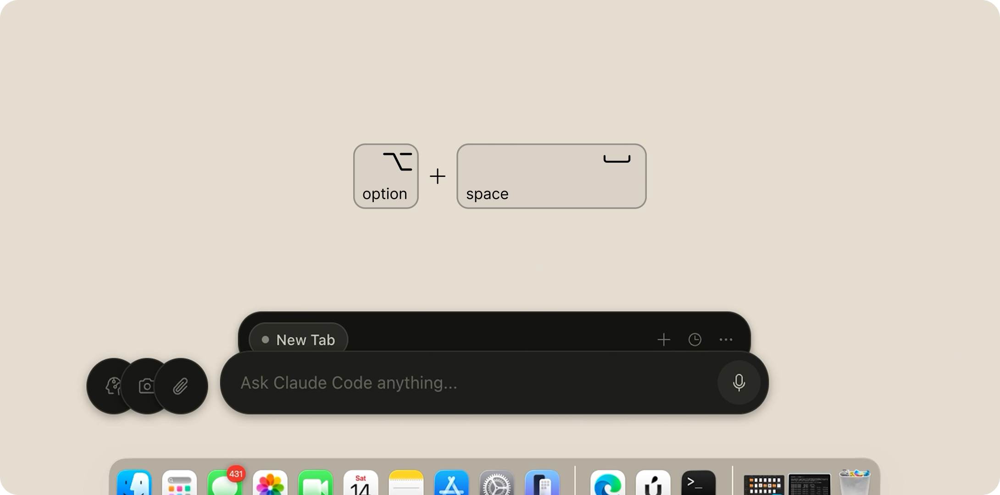

# Clui CC — Claude Code 的命令行用户界面

一款轻量、透明的 macOS 桌面悬浮窗，专为 [Claude Code](https://docs.anthropic.com/en/docs/claude-code) 打造。Clui CC 将 Claude Code CLI 封装在一个浮动胶囊界面中，支持多标签页会话、权限审批界面、语音输入和技能市场。

## 演示

[](https://www.youtube.com/watch?v=NqRBIpaA4Fk)

<p align="center"><a href="https://www.youtube.com/watch?v=NqRBIpaA4Fk">▶ 在 YouTube 上观看完整演示</a></p>

## 功能特性

- **浮动悬浮窗** — 透明、可穿透点击的置顶窗口。使用 `⌥ + Space` 切换显示/隐藏（备选：`Cmd+Shift+K`）。
- **多标签页会话** — 每个标签页独立启动 `claude -p` 进程，拥有独立的会话状态。
- **权限审批界面** — 通过 PreToolUse HTTP 钩子拦截工具调用，方便你在界面中审核并批准/拒绝。
- **对话历史** — 浏览和恢复过往的 Claude Code 会话。
- **技能市场** — 无需离开 Clui CC 即可安装来自 Anthropic GitHub 仓库的插件。
- **语音输入** — 通过 Whisper 实现本地语音转文字（必需，自动安装）。
- **文件和截图附件** — 直接粘贴图片或附加文件。
- **双主题模式** — 深色/浅色模式，支持跟随系统设置。

## 为什么选择 Clui CC

- **Claude Code，但更可视化** — 保留 CLI 的强大能力，同时提供快速的桌面交互体验，方便审批、查看历史和多任务处理。
- **人在回路的安全保障** — 工具调用在执行前会在应用内进行审核和批准。
- **会话原生工作流** — 每个标签页运行独立的 Claude 会话，可随时恢复。
- **本地优先** — 一切通过本地 Claude CLI 运行。无遥测、无云依赖。

## 工作原理

```
用户输入 → 主进程启动 claude -p → NDJSON 流 → 实时渲染
                                        → 工具调用？ → 权限界面 → 批准/拒绝
```

详见 [`docs/ARCHITECTURE.md`](docs/ARCHITECTURE.md) 获取完整的深入解析。

## 安装应用（推荐）

最快将 Clui CC 作为常规 Mac 应用运行的方式。此安装方式会安装依赖、语音支持（Whisper），构建应用，将其复制到 `/Applications`，并启动。

**1) 克隆仓库**

```bash
git clone https://github.com/lcoutodemos/clui-cc.git
```

**2) 双击 `install-app.command`**

在 Finder 中打开 `clui-cc` 文件夹，双击 `install-app.command`。

> **首次启动：** macOS 可能会因为应用未签名而阻止运行。请前往 **系统设置 → 隐私与安全性 → 仍然打开**。此操作只需执行一次。
> **文件夹清理：** 安装程序会在安装成功后自动清理临时的 `dist/` 和 `release/` 文件夹，保持仓库整洁。

<p align="center"></p>

首次安装后，只需从应用程序文件夹或 Spotlight 打开 **Clui CC** 即可。

<details>
<summary><strong>终端 / 开发者命令</strong></summary>

根目录仅保留 `install-app.command` 以方便非技术用户。开发者脚本位于 `commands/` 目录。

### 快速开始（终端）

```bash
git clone https://github.com/lcoutodemos/clui-cc.git
```

```bash
cd clui-cc
```

```bash
./commands/setup.command
```

```bash
./commands/start.command
```

> 按 **⌥ + Space** 显示/隐藏悬浮窗。如果 macOS 输入法占用了该快捷键，请使用 **Cmd+Shift+K**。

停止运行：

```bash
./commands/stop.command
```

### 开发者工作流

```bash
npm install
```

```bash
npm run dev
```

渲染进程的更改会即时更新。主进程的更改需要重启 `npm run dev`。

### 其他命令

| 命令 | 用途 |
|------|------|
| `./commands/setup.command` | 环境检查 + 安装依赖 |
| `./commands/start.command` | 从源码构建并启动 |
| `./commands/stop.command` | 停止所有 Clui CC 进程 |
| `npm run build` | 生产构建（不含打包） |
| `npm run dist` | 打包为 macOS `.app` 到 `release/` |
| `npm run doctor` | 运行环境诊断 |

</details>

<details>
<summary><strong>前置条件（详细说明）</strong></summary>

你需要 **macOS 13+**。然后逐一安装以下内容 — 复制每条命令并粘贴到终端执行。

**步骤 1.** 安装 Xcode 命令行工具（编译原生模块所需）：

```bash
xcode-select --install
```

**步骤 2.** 安装 Node.js（推荐：当前 LTS 版本，如 20 或 22；最低支持版本：18）。从 [nodejs.org](https://nodejs.org) 下载，或使用 Homebrew：

```bash
brew install node
```

验证是否已添加到 PATH：

```bash
node --version
```

**步骤 3.** 确保 Python 安装了 `setuptools`（原生模块编译器需要）。在 Python 3.12+ 中默认未包含：

```bash
python3 -m pip install --upgrade pip setuptools
```

**步骤 4.** 安装 Claude Code CLI：

```bash
npm install -g @anthropic-ai/claude-code
```

**步骤 5.** 认证 Claude Code（按照出现的提示操作）：

```bash
claude
```

**步骤 6.** 安装 Whisper 以支持语音输入：

```bash
# Apple Silicon (M1/M2/M3/M4) — 首选：
brew install whisperkit-cli
# Apple Silicon 备选，或 Intel Mac：
brew install whisper-cpp
```

> **无需 API 密钥或 `.env` 文件。** Clui CC 使用你现有的 Claude Code CLI 认证（Pro/Team/Enterprise 订阅）。

</details>

<details>
<summary><strong>架构与内部机制</strong></summary>

### 项目结构

```
src/
├── main/                   # Electron 主进程
│   ├── claude/             # ControlPlane、RunManager、EventNormalizer
│   ├── hooks/              # PermissionServer（PreToolUse HTTP 钩子）
│   ├── marketplace/        # 插件目录获取与安装
│   ├── skills/             # 技能自动安装器
│   └── index.ts            # 窗口创建、IPC 处理、系统托盘
├── renderer/               # React 前端
│   ├── components/         # TabStrip、ConversationView、InputBar 等
│   ├── stores/             # Zustand 会话存储
│   ├── hooks/              # 事件监听器、健康状态协调
│   └── theme.ts            # 双色调色板 + CSS 自定义属性
├── preload/                # 安全 IPC 桥接（window.clui API）
└── shared/                 # 通用类型、IPC 通道定义
```

### 工作原理

1. 每个标签页创建一个 `claude -p --output-format stream-json` 子进程。
2. NDJSON 事件由 `RunManager` 解析，并由 `EventNormalizer` 标准化。
3. `ControlPlane` 管理标签页生命周期（连接中 → 空闲 → 运行中 → 已完成/失败/已断开）。
4. 工具权限请求通过 HTTP 钩子发送到 `PermissionServer`（仅限本地主机）。
5. 渲染进程每 1.5 秒轮询后端健康状态并协调标签页状态。
6. 通过 `--resume <session-id>` 恢复会话以保持连续性。

### 网络行为

Clui CC 几乎完全离线运行。唯一的外部网络请求为：

| 端点 | 用途 | 是否必需 |
|------|------|----------|
| `raw.githubusercontent.com/anthropics/*` | 市场目录（缓存 5 分钟） | 否 — 优雅降级 |
| `api.github.com/repos/anthropics/*/tarball/*` | 启动时自动安装技能 | 否 — 失败时跳过 |

无遥测、无分析、无自动更新机制。所有核心 Claude Code 交互均通过本地 CLI 进行。

</details>

## 故障排除

关于安装问题和恢复命令，请参阅 [`docs/TROUBLESHOOTING.md`](docs/TROUBLESHOOTING.md)。

快速自检：

```bash
npm run doctor
```

## 测试环境

| 组件 | 版本 |
|------|------|
| macOS | 15.x (Sequoia) |
| Node.js | 20.x LTS, 22.x |
| Python | 3.12（已安装 setuptools） |
| Electron | 33.x |
| Claude Code CLI | 2.1.71 |

## 已知限制

- **仅限 macOS** — 透明悬浮窗、系统托盘图标和 node-pty 均为 macOS 特有功能。目前不支持 Windows/Linux。
- **需要 Claude Code CLI** — Clui CC 是一个 UI 层，不是独立的 AI 客户端。你需要一个已认证的 `claude` CLI。
- **权限模式** — 使用 `--permission-mode default`。PTY 交互传输为旧版功能，默认禁用。

## 许可证

[MIT](LICENSE)
